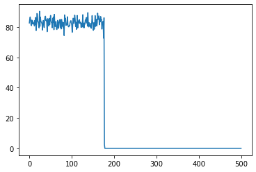

# State Space for OCR

## Data Extraction

```python

def obtain_files():
    folders = ['train_annotations', 'test_annotations']
    files = np.array([])
    for folder in folders:
        files = np.append(files, glob("../" + folder + "/*.json"))

    return files

```

## Data Assimilation for Character Labelling

```python

def obtain_corpus(files):
    corpus = []
    labels = []
    for file in tqdm(files):
        data = json.load(open(file, 'r'))
        corpus.append([data['form'][i]['text'] for i in range(len(data['form']))])
        labels.append([data['form'][i]['label'] for i in range(len(data['form']))])

    return corpus, labels

```

## TfIdf Vector and Latent Semantic Analysis

```python

def tfidf_vectorizer(corpus):
    vectorizer = TfidfVectorizer()
    tfidf = vectorizer.fit_transform([' '.join(c) for c in corpus])
    
    return tfidf

def latent_semantic_analysis(tfidf):
    svd = TruncatedSVD(n_components=4, n_iter=7, random_state=42)
    svd.fit(tfidf)

    return svd

```

## Training of dataset parameters

For the OCR project, the state space dimensions are:

- Observations: 199
- Transitions: 5823

The results of running MCTS on OCR Data are shown here:

### Episode scores for OCR:

**As you can see the rewards obtained here are asymptotic in nature.**



___________________________

### MCTS Results

#### OCR data

The MCTS algorithm replicates the source dataset of ocr for searching the dataset:

- by latent sematic analysis similarities
- by maximising the reward by a regularized similarity

```python

MAX_CLUSTERS = 1000
NOISE_PARAM = 4.30

mcts_reward = (MAX_CLUSTERS - self.cluster) / MAX_CLUSTERS + NOISE_PARAM - \
        scaler.transform(((np.array([self.similarity]*action_count) - similarity_mean) / similarity_std).reshape(1,-1)).flatten()[0]

```

