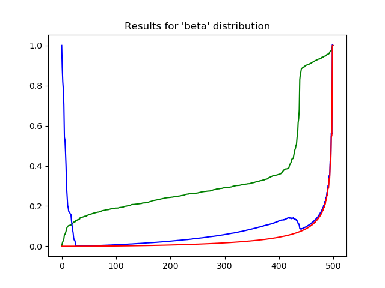
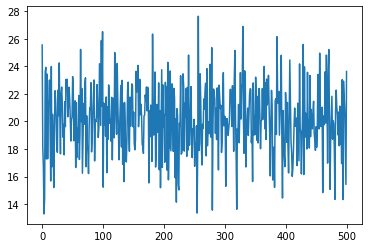

## State Space for Speech

```python

def process_feat(samp_rate=48000):

    # code here
    
    x, s = librosa.core.load(wav_file)

    fe = sp.FrontEnd(samp_rate=s,mean_norm_feat=True,
        frame_duration=0.032, frame_shift=0.02274,hi_freq=8000)

    feat = fe.process_utterance(x)

```

### ICA

For evaluating ICA mixing matrix, a random_state=42 is used. 

```python

def process_ica(feat_actors, random_state=42):
    # code here
    ica = FastICA(n_components=n_actors, random_state=42)
    # code here

```

### Factor Analysis

For evaluating Factor Matrix with Noises, the means of the ica mixing matrix are stacked as shown here.

The factor analysis uses a library which can be installed using:

> pip install --user factor_analysis==0.0.2

```python

def process_factors(ica_mixing_array, strings):
    # code here
    # here, state_dim is the speech audio string

    f = factor_analysis.factors.Factor(ica_mixing_array[state_dim], 
    factor_analysis.posterior.Posterior(np.cov(ica_mixing.T), 
    
    # mean values are stacked by number of actors here for factor analysis input

    np.concatenate([

        np.mean(ica_mixing,axis=0).reshape(1,-1)/ica_mixing.shape[1]

    ] * ica_mixing.shape[1], axis=0)))

```

## Training of dataset parameters

For the Speech project, the state space dimensions are:

- Observations: 60
- Transitions: 24

The results of running MCTS on Speech are shown here:

### Episode scores for Speech:

**As you can see the rewards obtained here (colored green) are either power series or harmonic functions but not asymptotic in nature.**





___________________________

### MCTS Results

#### Speech

The MCTS algorithm replicates the source dataset of speech for searching the dataset:

- by factor analysis correlation
- by maximising the reward by least noise

In the case of MAX_CLUSTERS = 11, MCTS coverage is obtained to be 1.0
In the case of MAX_CLUSTERS = 20, MCTS coverage is obtained to be 0.75

```python

MAX_CLUSTERS = 11
NOISE_PARAM = 4.30

mcts_reward = (MAX_CLUSTERS - self.cluster) / MAX_CLUSTERS + NOISE_PARAM - \
        scaler.transform(((np.array([self.noise]*action_count) - noise_mean) / noise_std).reshape(1,-1)).flatten()[0]

```